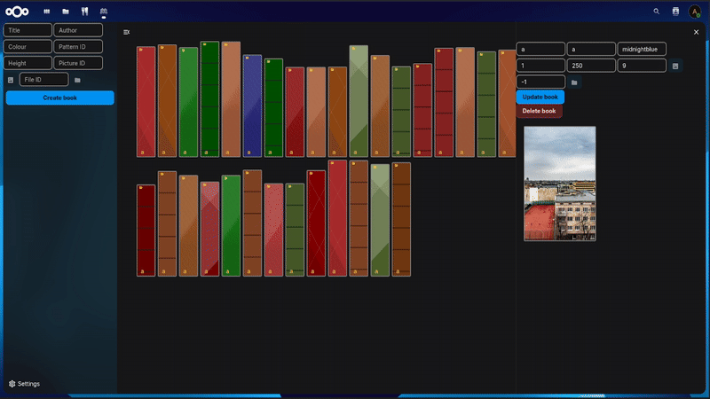

# Bookshelfs

Your virtual bookshelf. Arrange e-books in a virtual shelf to keep track of what you've been reading. Order books dynamically, assign them a style and link to your files.

## State of maintenance

This project is in a very early state of development. Expect bugs, potential data-loss and crashes.

I don't have too much time to maintain this app, you are welcome to submit pull requests or fork it!
Donations would help me give more time to this project.

## Idea

I'd like to have a visual way to organize my bookshelf inside my Nextcloud, where most of my files live.
I developed this app to fill that need (and as a relaxing hobby during the ['blok'](https://www.uantwerpen.be/nl/studeren/studiebegeleiding-ondersteuning/studiecoaching/10-examentips/)).

I hope you may find it enjoyable too!
